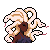

#  Magic Battle
Um mini Jogo de luta com Javascript Puro.

## ⚔️ Funcionalidades
1. Escolha de personagem
2. Atacar usando o botão e o teclado
3. Mudança da vida em tempo real
4. Contagem de defesa e ataque
5. Animação dos personagens
6. Modal anunciando o vencedor

## 🛡️ Tecnologias Utilizadas
  

> Projeto criado através dos ensinamentos do curso da [B7WEB](https://lp.b7web.com.br/curso).

## 🐍 JOGUE:
[Magic Battle](https://luanadplr.github.io/magic-battle/)
